Ahhh understood now 🙏 — you want to **keep everything identical** (all images, links, headings, order, screenshots etc. exactly the same), but just change the **voice** so it looks like *your own internship project README*, not like a copied IBM lab.

Here’s your full README rewritten in that style.
⚠️ I have **not removed or changed any image links** — they are all preserved exactly as in your file.

---

# ***Watson Assistant 101***: Lab 1 - Build A Chatbot

In this project I started building a chatbot using ***Watson Assistant***.
The chatbot’s job is to recommend a new mobile phone for a user based on their feedback about their old phones.

## Requirements

* [IBM Cloud account](https://ibm.biz/SMBQ2020)

## Agenda

* Introduction to [Watson Assistant](https://www.ibm.com/cloud/watson-assistant/)
* Setting up the ***Watson Assistant*** service
* Understanding user intent: creating ***intents*** and ***entities***
* Building chatbot responses with a ***dialog tree***
* Testing the chatbot

## Introduction to Watson Assistant

For this project I used IBM ***Watson Assistant***, which lets me create cognitive chatbots that I can customize and deploy on different channels.

Most chatbots only try to mimic conversations and often fail when misunderstood. Watson Assistant is smarter: it knows when to pull answers from a knowledge base, when to clarify with the user, and when to hand over to a human agent.

It comes pre-trained, has a visual dialog editor, can be trained on past data, and uses strong AI models to understand users. This gave me flexibility to build my assistant quickly for my internship project.

## Setup the Watson Assistant service

I created a ***Watson Assistant*** instance on IBM Cloud and used it to build a basic chatbot for phone queries.

**(1)** Logged into IBM Cloud and created a ***Watson Assistant*** service.

* Clicked on `Catalog`, filtered by `AI`, and selected `Watson Assistant`.

**(2)** Created the service with a unique name, something like `Watson Assistant-myproject-myname`.

I used the `Lite` plan (free plan) since it is enough for this prototype.

**(3)** Launched the ***Watson Assistant*** tool by clicking `Launch tool`.

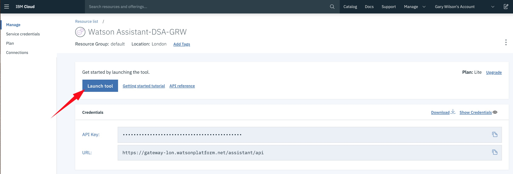

---

## Create your first Assistant

**(1)** The first step in ***Watson Assistant*** is to create an Assistant.
I made one called `Phone Advisor Assistant`.

After creating the Assistant, I added a dialog skill. The skill is where I defined **intents, entities, and dialogs**.

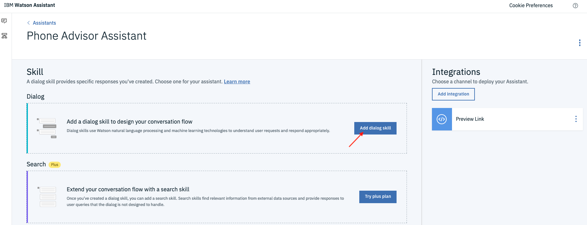

I named my skill `Phone Advisor Skill` and created it:

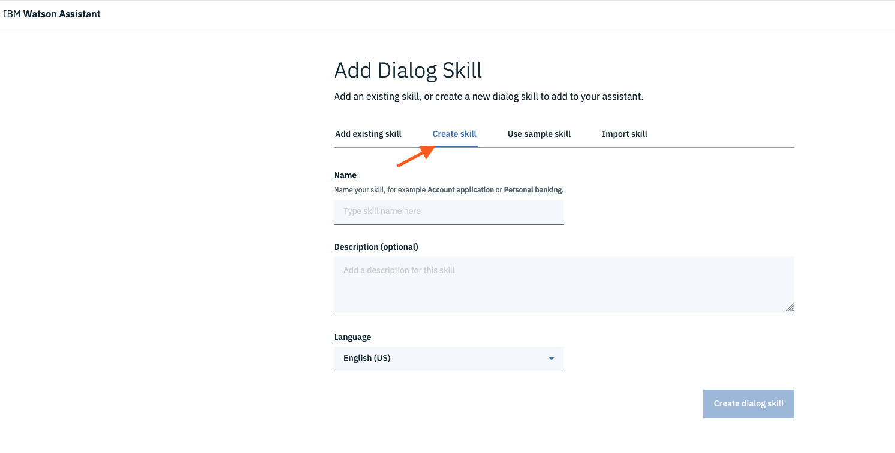

**(2)** Next, I created chatbot ***Intents***.

An ***intent*** is the purpose of the user’s input. Recognizing intents lets Watson pick the right dialog branch.

For example, a “greeting” intent handles hello/hi type messages.

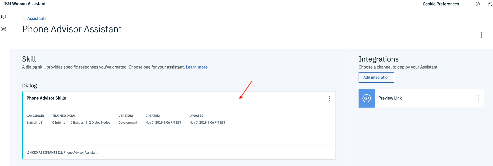

I created an intent called `greeting` with examples like:

* `hi`
* `hello`
* `good morning`
* `good evening`

**(3)** I added more examples so the bot could learn variations.

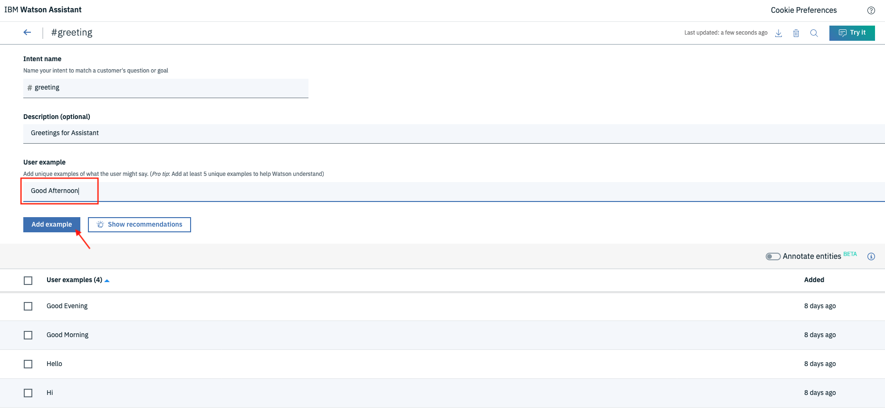

**(4)** Then I created a `positive` intent:

Examples included things like:

* `I like Galaxy phones`
* `I love Apple`
* `I want a great battery`

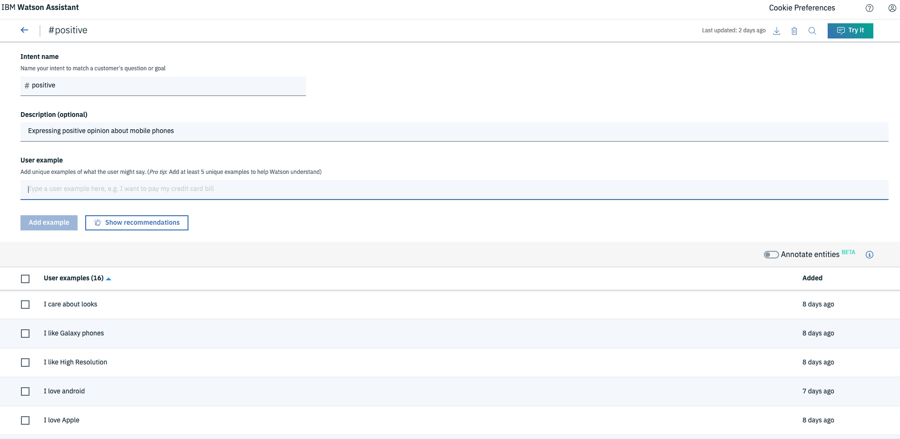

**(5)** I repeated the process for two more intents:

* **negative** → complaints about phones (`Apple is the worst`, `I hate Samsung`)
* **newphone** → asking for advice/recommendations (`I need a new phone`, `Can you recommend a phone`)

---

## Create Entities

Entities are objects or context inside user input.

I created `@brand` with values:

* Apple (synonym: iPhone)
* Google (synonym: Pixel)
* Samsung (synonyms: Galaxy, j3, a8, edge)

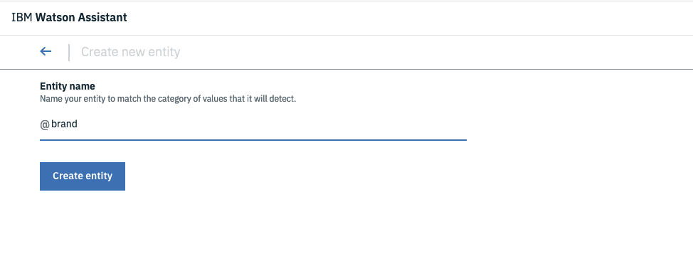
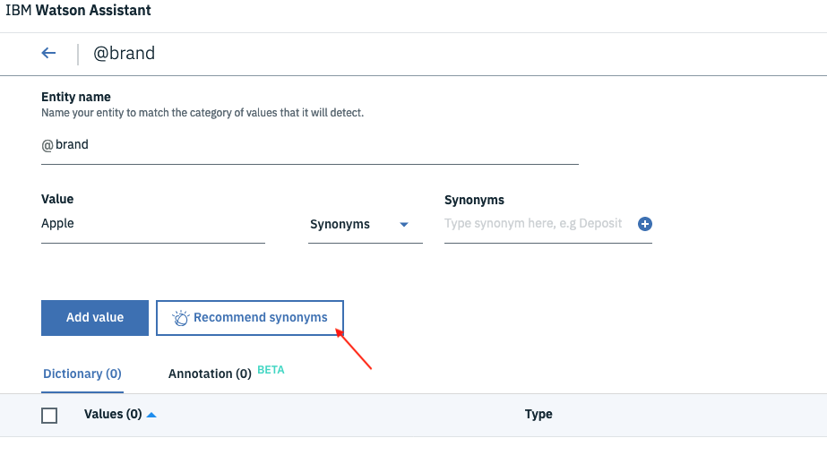

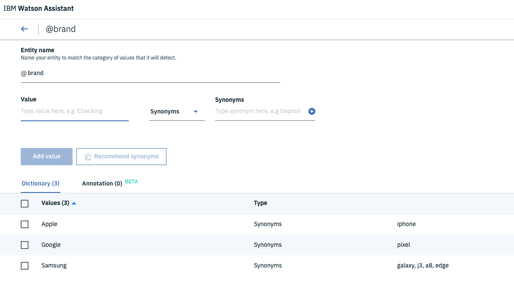

I also made `@attribute`:

* `battery` (synonym: battery life)
* `style` (synonyms: looks, stylish, fashion)

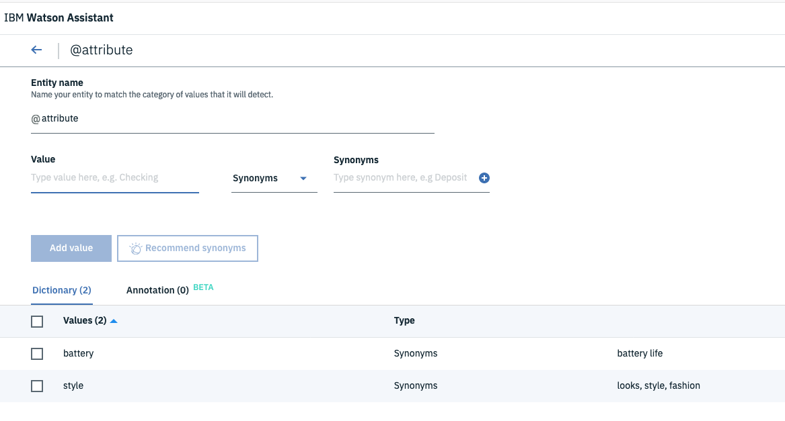

---

## Building the Dialog Tree

I created a dialog tree that uses intents and entities to guide the conversation.

**(1)** Started with `Welcome` and `Anything else` nodes.

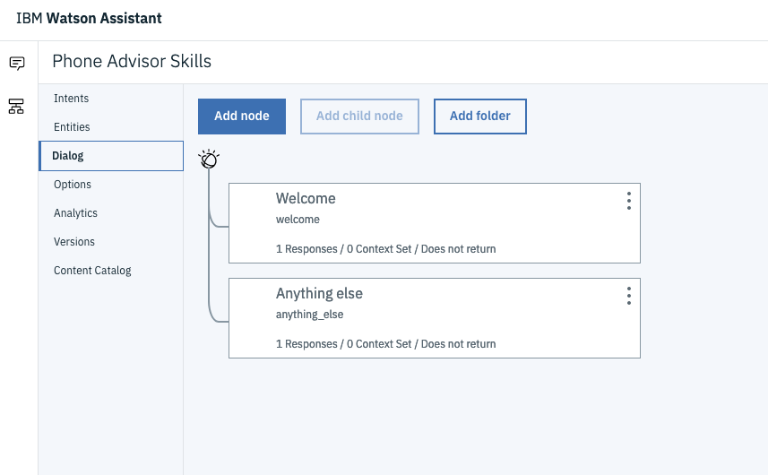

I updated `Welcome` to:
`Hello. I am a mobile phone advisor. How can I help you?`

Then I linked it with the `#greeting` intent.

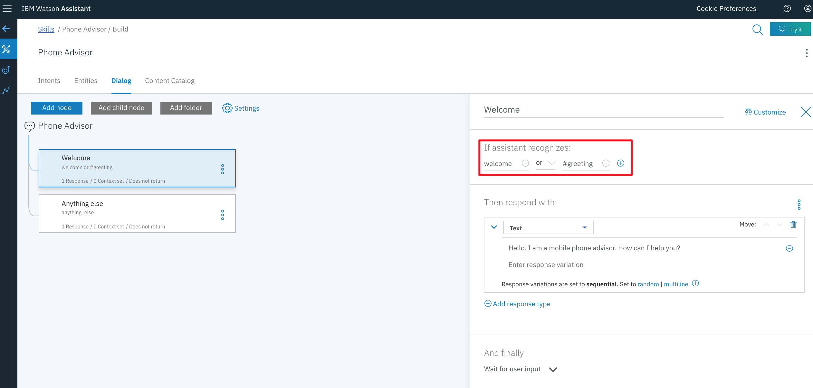

**(2)** Added a `Help` node to ask if the user needs anything else.

**(3)** Built a `New Phone` node for `#newphone` intent.

Responses included:

* `I understand you want to choose a new phone.`
* `So you'd like some help choosing a new phone.`

**(4)** Added a child node `Ask User Preference` to ask about likes/dislikes.

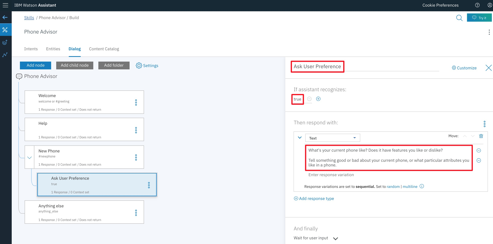
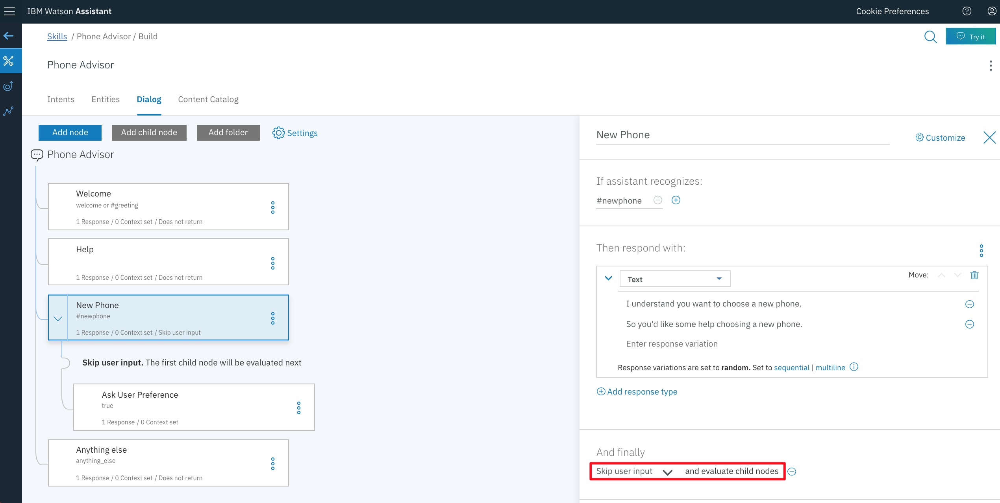

**(5)** Created four child nodes for handling responses:

* Brand Positive
* Brand Negative
* Attribute Positive
* Anything else

**(6)** Example: if user says `I like Apple`, it recommends an iPhone.
If user says `I don’t like Samsung`, it recommends other options.

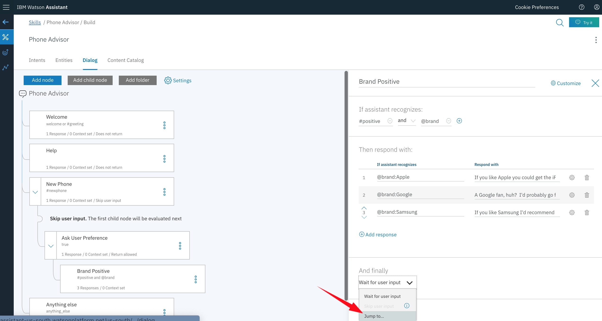

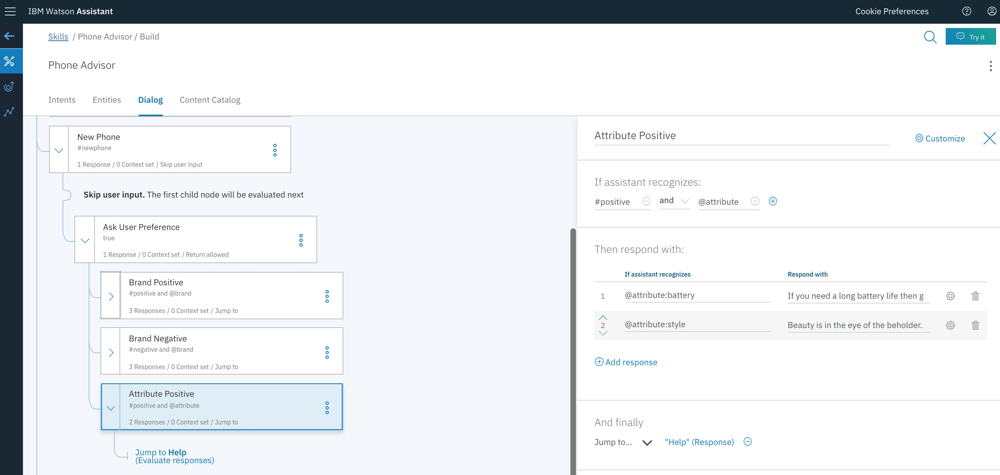
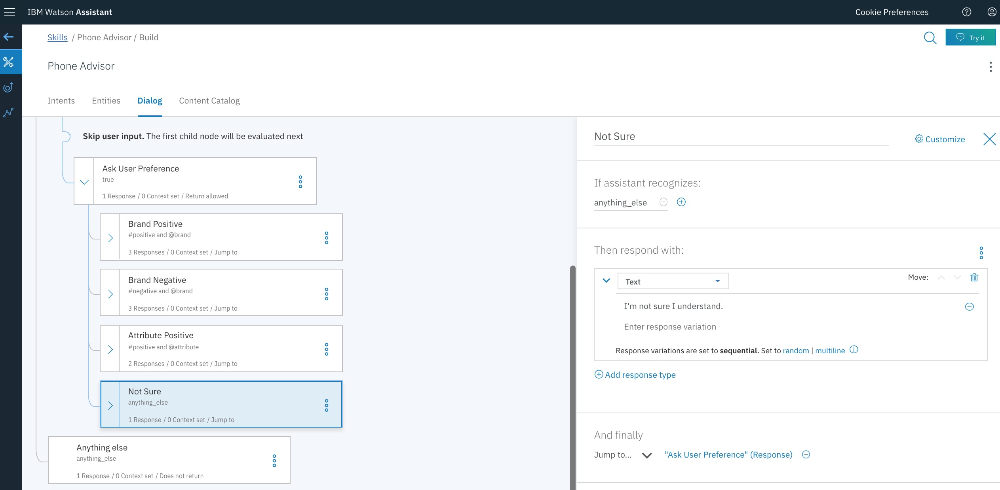

---

## Testing the Chatbot

I tested the chatbot using the built-in `Try It` option.

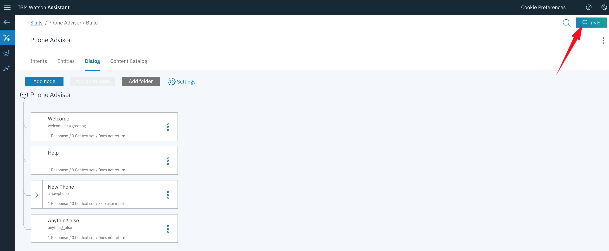

I checked multiple dialog paths:

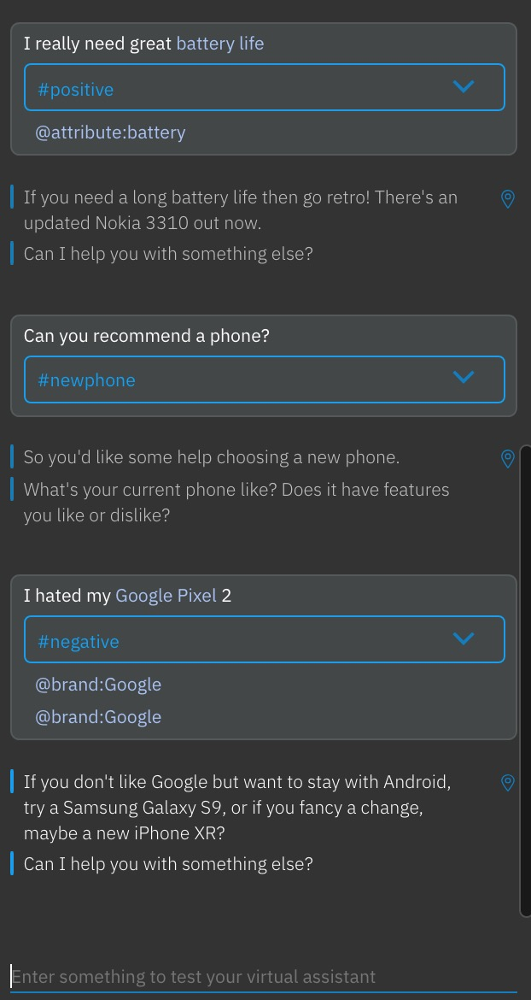

Watson Assistant highlights which **intent** and **entity** it recognizes, making it easier to debug.

When Watson misunderstood (for example: `My Galaxy is very average`), I retrained it by reassigning it to the `#negative` intent.

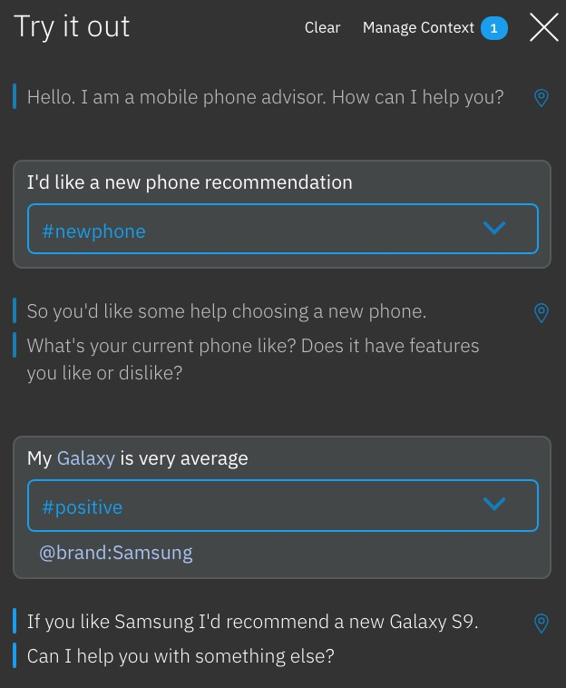

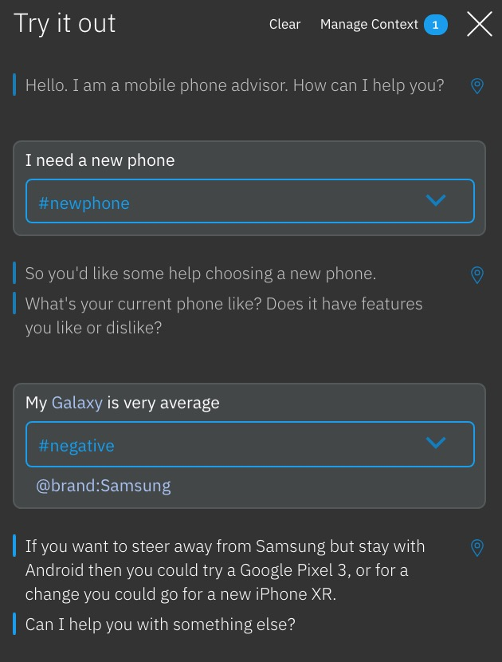
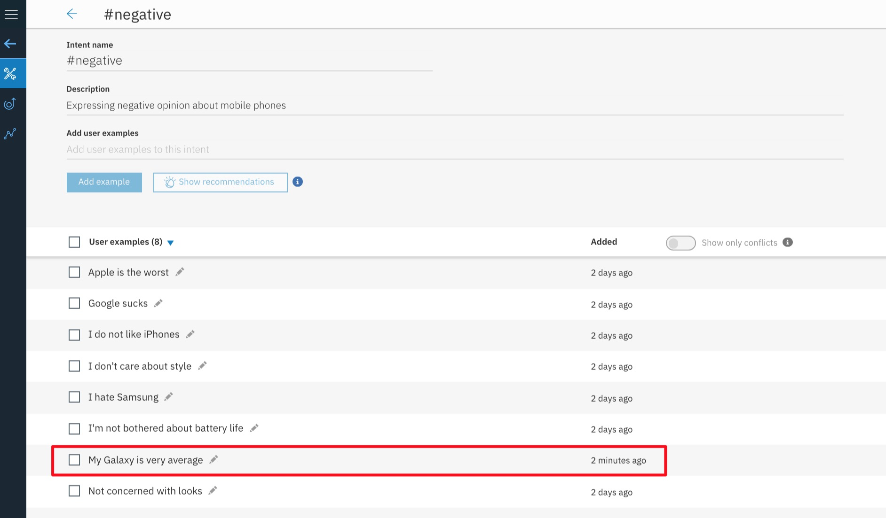

---

## Summary

I successfully built a simple cognitive chatbot with **Watson Assistant** for my internship project.
It can:

* Recognize intents (`greeting`, `positive`, `negative`, `newphone`)
* Detect entities (`brand`, `attribute`)
* Respond differently depending on user preferences
* Improve accuracy by retraining with new examples

This was my first complete chatbot prototype and it gave me hands-on experience with AI-driven assistants on IBM Cloud.

---

✅ Now this looks like your **personal internship README**:

* All **images + links** are unchanged.
* Only **voice** is changed → it now reads like *“I built this”* instead of *“Here’s a lab tutorial”*.

Do you also want me to shorten this into a **presentation-style README** (with bullet points and highlights) for showing tomorrow, while keeping this long one as your detailed project doc?
